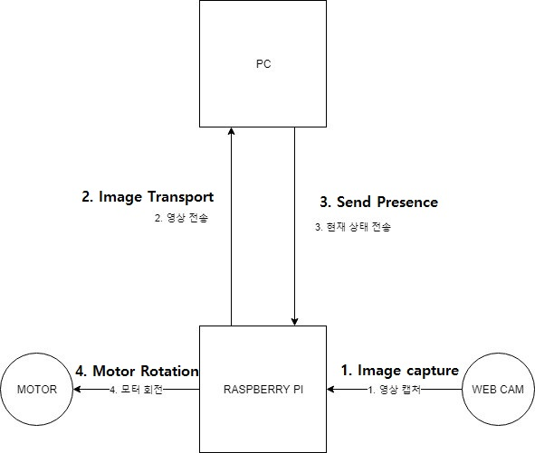
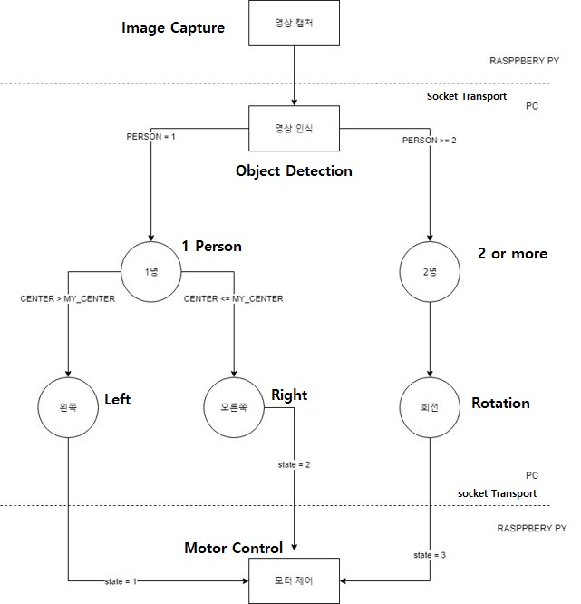

#  Automatic rotating fan module using AI
> if you have a fan and install the module, you will use Automatic rotating fan.

 This project is the 2019 1st Semester Converged Capstone Design Project. 

 We learned AI in the first semester of 2019. we thought to use AI. And, we thought it would be all right if we made a fan to follow people in the hot summer. so, we made Automatic rotating fan module using object detection.

## Component

Device

- Raspberry pi 3B+
- Stepper Motor
- Touch Monitor
- Web cam
- PC

#### Outline Map

#### H/W Circuit

 

#### 3D Model

#### Algorithm

## Team members

- 유형준(Yoo Hyeong Jun) - Software Development [[Github](https://github.com/cocopambag)] [jhdf1234@naver.com]

- 김진호 - 3D Modeling [[Github](https://github.com/hiptoo1)] [hiptoo1@naver.com]

- 이대건  - Hardware Development [longchim@naver.com]

- 이정훈 - Software Development [ljh9032a@naver.com]

- 전주하 - Paperwork [hwe1123@naver.com]

## Reference Materials

- Object Detection - [[EdjeElectronics](https://github.com/EdjeElectronics/TensorFlow-Object-Detection-API-Tutorial-Train-Multiple-Objects-Windows-10)]
- Socket Transport - [[brownbears](https://brownbears.tistory.com/207)]
- Motor Control - [[Chandong83](https://brownbears.tistory.com/207)]